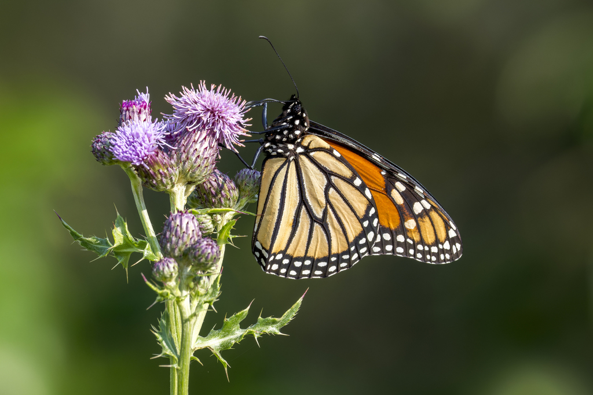
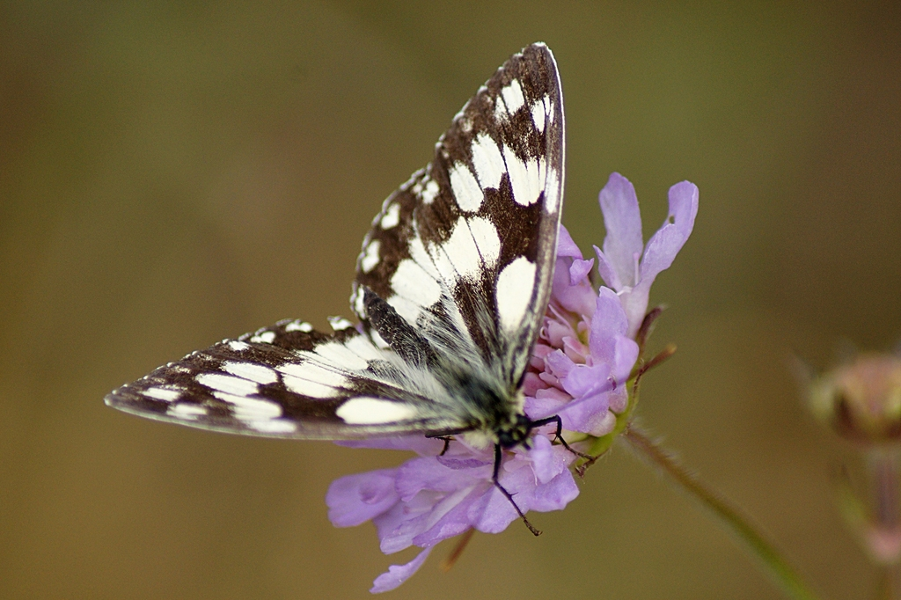
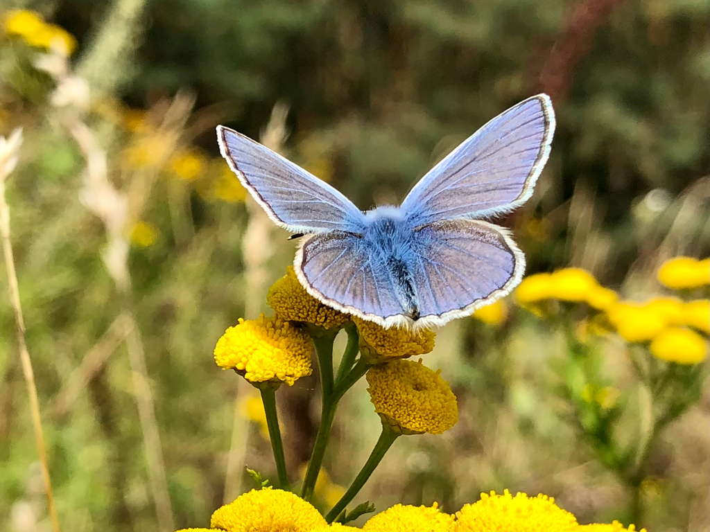

# Butterfly Species Classification with a Custom CNN

This project designs, trains, and evaluates a convolutional neural network that classifies butterfly images sourced from [iNaturalist](https://www.inaturalist.org) observations. Rather than predicting across the full long-tail of species in the dataset, the model targets the 9 most frequently observed species in the training set, with every other species collapsed into a 10th "other" class — a common strategy for handling extreme class imbalance in real-world biodiversity data.

<table align="center">
  <tr>
    <td></td>
    <td></td>
    <td></td>
  </tr>
</table>

## Model Architecture

The proposed ButterflyCNN is a custom residual convolutional neural network developed for fine-grained butterfly species classification. Unlike transfer learning approaches that rely on pretrained models, this architecture is specifically designed to learn discriminative visual features directly from the iNaturalist butterfly dataset. The network begins with a convolutional stem that extracts low-level features such as edges, colors, and textures, followed by five sequential residual stages. Each stage contains two residual blocks, with the number of feature channels progressively increasing from 64 to 512, while max-pooling layers reduce the spatial dimensions of the feature maps. This hierarchical design enables the network to capture increasingly complex characteristics, including wing patterns, venation, color distributions, and species-specific morphological details.

## Course

DS 542 - Deep Learning for Data Science 
Boston University

